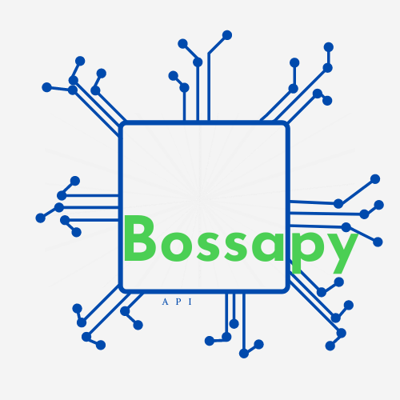

# Bossapy

This repository is where development of python version of connection to Bossa API algotrading interface takes place. 

This is an open-source project without affiliation to DM BOŚ brokerage. So far no python bindings for Bossa API are avaliable thus the `bossapy` tries to fill that gap. 

The project was initially created by Fey and Jarek to facilitate data gathering, and we are planning to extend it with simple algotrading strategies via Bossa API in python ecosystem. We do all of our development work here. If you are willing to contribute you are welcome. 

This source code is available to everyone under the Apache v2.0 license.  

[PL](README_PL.md) version of readme

# Installation
In order to use the Bossa API, it is necessary to have a brokerage account with DM BOŚ.

### NOL trading platform
To use `bossapy` you must have [NOL](https://bossa.pl/oferta/narzedzia/bossanol3) software installed. You need to login to your DM BOŚ account to download NOL installation binaries. NOL is avaliable for Windows platform. NOL is a program through which data is made avaliable to `bossapy` via Bossa API.
In case of any issues with NOL please consult user NOL [manual](https://bossa.pl/sites/b30/files/2021-04/document/Podrecznik_bossaNOL3.pdf).

There is also [Bossa API manual](https://bossa.pl/sites/b30/files/2021-04/document/Podrecznik_bossaAPI.pdf) avaliable.  .

### __`bossapy`__ module
Move the files from the current [git repository](https://github.com/FeyyM/bossapy) to any local directory in order to launch the module.

# Launching

In order to launch 'bossapy` follow these steps:
1. Log in to the DM BOŚ online trading system via the browser [login](https://online.bossa.pl/bossaapp/login)
2. Go to the Notowania tab and click run NOL, which will launch the NOL program on your local computer. In this way, the NOL program logs to your DM BOS brokerage account. The data connection to `bossapy` is then open. On initial run of NOL program you need to enable Bossa API interface. The switch is avaliable in Narzędzia menu.
3. Run main.py from the local directory of `bossapy`.

## Contributing 🙋‍♂️?

Contributing to the project is welcome. See [Contribution Policy](CONTRIBUTING.md). You can also take a look at [current issues](https://github.com/FeyyM/bossapy/issues) for getting more information about current or upcoming tasks.

## Discussion 💬

If you have any questions or doubts, you can start a discussion.
[Discussion](https://github.com/FeyyM/bossapy/discussions).

## License

Licensed under the Apache License, Version 2.0 (the "License");
you may not use this file except in compliance with the License.
You may obtain a copy of the License at

    http://www.apache.org/licenses/LICENSE-2.0

Unless required by applicable law or agreed to in writing, software
distributed under the License is distributed on an "AS IS" BASIS,
WITHOUT WARRANTIES OR CONDITIONS OF ANY KIND, either express or implied.
See the License for the specific language governing permissions and
limitations under the License.